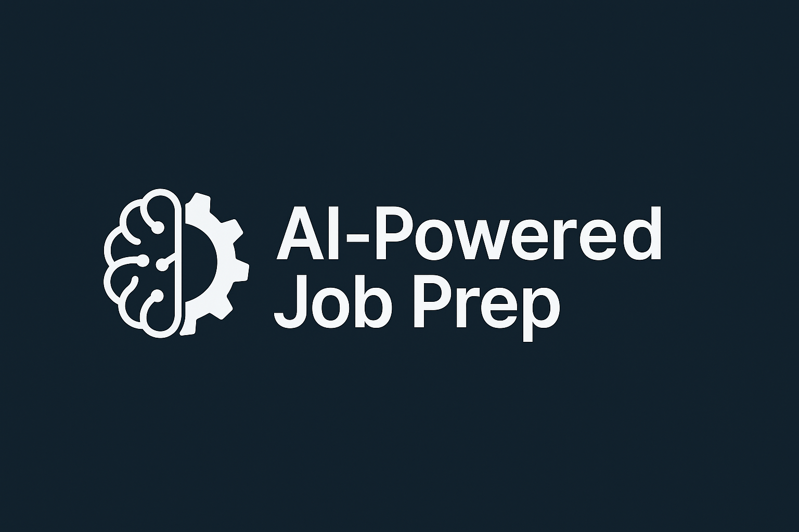

# AI-Powered Job Prep

An **AI-powered SaaS app** to help job seekers prepare for interviews with tailored practice, résumé analysis, and technical Q&A. Built with **Next.js 15**, **TypeScript**, **Tailwind CSS v4**, and **shadcn/ui**, following a clean, scalable architecture with pro-grade tooling.

---

## ✨ Features

- 🤖 **AI Assistance** – practice interviews, résumé feedback, and technical Q&A
- 🎨 **Modern UI** – Next.js 15 (App Router) + Tailwind v4 + shadcn/ui
- 🗂 **Scalable Architecture** – feature slices, path aliases, Drizzle ORM
- 🗄 **Database** – PostgreSQL + Drizzle ORM migrations
- 🧪 **Testing** – Vitest, React Testing Library, MSW
- 🚦 **CI/CD** – GitHub Actions (typecheck → lint → test → build)
- ☁️ **Deployment** – Vercel (preview URLs for every PR)

---

## 📦 Tech Stack

- **Framework**: Next.js 15 (App Router)
- **Language**: TypeScript
- **Styling**: Tailwind CSS v4
- **UI**: shadcn/ui (Radix primitives, CVA, tailwind-merge)
- **State**: Zustand
- **Database**: PostgreSQL + Drizzle ORM
- **Testing**: Vitest, React Testing Library, MSW
- **CI/CD**: GitHub Actions + Vercel
- **Package manager**: pnpm
- **Node**: 20.x

---
